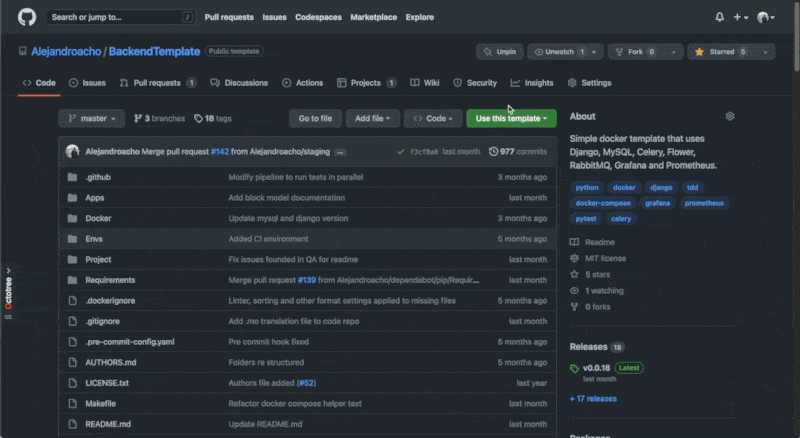

# Docker action

Docker github action is very useful to integrate our repo to DockerHub in order to make easy the traceability and deployment of the app.

## Installation

This action is already implemented, if you don't want to use it you can erase it from the pipeline in `.github/workflows/push-workflow.yml`, is the job named "Docker-Tag".

## Using it

In order to be able to use it (and not breaking the pipeline), you may add the following actions secrets on your repo:

  - DOCKERHUB_REPONAME
  - DOCKERHUB_USERNAME
  - DOCKERHUB_TOKEN

You can see the following example on how to add action secrets to our repo:

